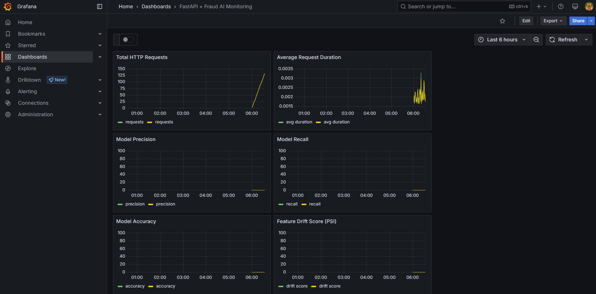

# Kafka-Spark-Airflow Monitoring Pipeline



## 📌 프로젝트 개요

이 프로젝트는 **Kafka**, **Spark**, **Airflow**, **FastAPI**, **Prometheus**, **Grafana**를 연동하여 실시간 이상거래 탐지 및 모니터링 시스템을 구축한 데모입니다.

- Kafka: 실시간 스트리밍 데이터 처리
- Spark: 이상 거래 탐지용 분석/모델 적용
- Airflow: 데이터 파이프라인 스케줄링
- FastAPI: 예측 요청 처리 REST API 서버
- Prometheus + Grafana: 모니터링 및 시각화

## 📁 폴더 구조

```bash
kafka_spark_airflow-main/
├── backend/ # FastAPI 서버
├── dags/ # Airflow DAG 정의
├── grafana/ # Grafana 대시보드 설정
├── kafka/ # Kafka 및 JMX 설정
├── prometheus/ # Prometheus 설정
├── spark/ # 이상거래 탐지 분석 코드
├── docker-compose.yml # 전체 서비스 구성
└── screenshot.png # Grafana 대시보드 이미지
```

## 🚀 빠른 시작

### 1. Docker Compose로 실행

```bash
docker-compose up --build

```

## 2. 주요 포트

- **FastAPI**: [http://localhost:8000](http://localhost:8000)
- **Airflow**: [http://localhost:8080](http://localhost:8080)
- **Prometheus**: [http://localhost:9090](http://localhost:9090)
- **Grafana**: [http://localhost:3000](http://localhost:3000)
- **Kafka**: `9092`
- **Spark UI**: `4040` (필요 시 노출)

## 3. Grafana 대시보드 접근

- **로그인**: `admin` / `admin`
- **사전 설정된 대시보드**:
  - FastAPI Application Metrics
  - Kafka, Spark 지표 모니터링

## 📊 커스텀 메트릭

`backend/app/server.py`에 정의된 FastAPI 서버는 Prometheus로 수집 가능한 다음과 같은 커스텀 메트릭을 제공합니다:

- `fraud_model_precision`
- `fraud_model_recall`
- `fraud_model_accuracy`
- `fraud_model_feature_drift`
- `fraud_transactions_total`

## 🧠 모델 학습

Airflow의 `dags/model_training.py` DAG에서 Spark 기반 이상거래 탐지 모델 학습이 주기적으로 실행됩니다.

## 🛠 주요 기술 스택

- Python 3.7+
- Docker, Docker Compose
- Apache Kafka
- Apache Spark
- Apache Airflow
- FastAPI
- Prometheus
- Grafana

## 📮 기여 방법

1. 이 프로젝트를 **Fork** 합니다.
2. 기능을 추가하거나 버그를 수정합니다.
3. **PR(Pull Request)** 를 보내주세요!
