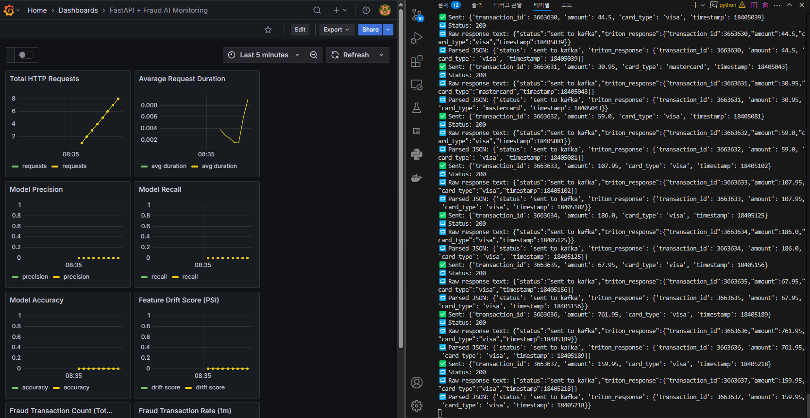
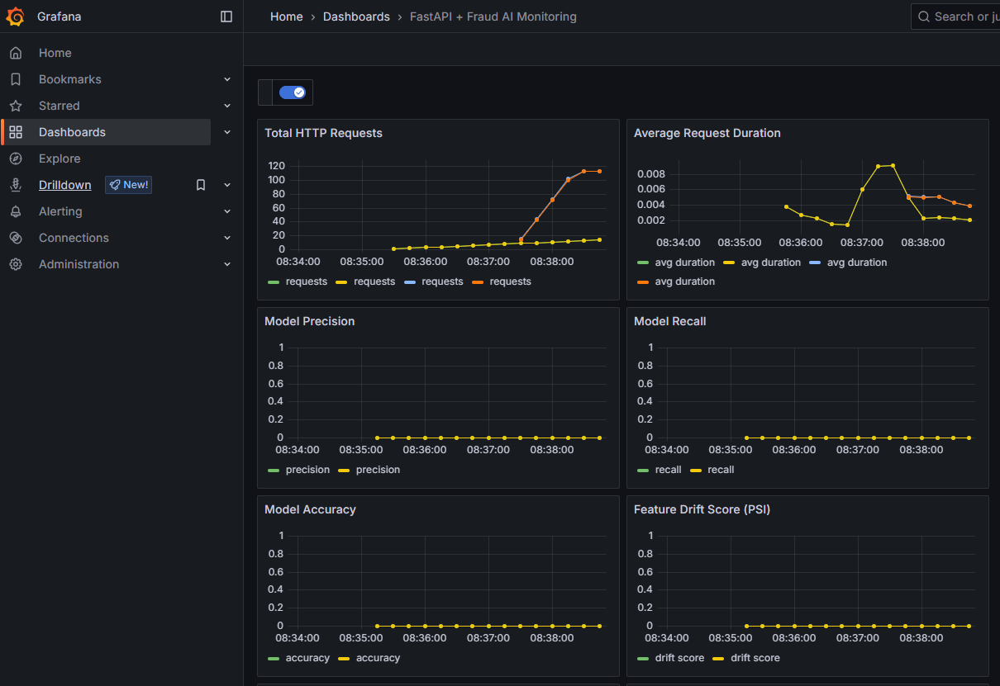

# Kafka-Spark-Airflow Monitoring Pipeline





## 📌 프로젝트 개요

이 프로젝트는 **Kafka**, **Spark**, **Airflow**, **FastAPI**, **Prometheus**, **Grafana**를 연동하여 실시간 이상거래 탐지 및 모니터링 시스템을 구축한 데모입니다.

## 🛠 주요 기술 스택

- Python 3.7+
- Docker, Docker Compose
- Apache Kafka
- Apache Spark
- Apache Airflow
- FastAPI
- Prometheus
- Grafana

## 🚀 빠른 시작

### 1. Docker Compose로 실행

```bash
docker-compose up --build

```

## 2. 주요 포트

- **FastAPI**: [http://localhost:8000](http://localhost:8000)
- **Airflow**: [http://localhost:8081](http://localhost:8081)
- **Prometheus**: [http://localhost:9090](http://localhost:9090)
- **Grafana**: [http://localhost:3000](http://localhost:3000)
- **Kafka**: `9092`
- **Spark UI**: `4040` (필요 시 노출)

## 3. Grafana 대시보드 접근

- **로그인**: `admin` / `admin`
- **사전 설정된 대시보드**:
  - FastAPI Application Metrics
  - Kafka, Spark 지표 모니터링

# 📘 실시간 이상탐지 시스템: 모니터링 지표 설계서

## 1. 🎯 목적

실시간 이상거래 탐지 시스템은 라벨이 없는 상태의 실시간 거래 스트림을 처리하므로,  
모델 성능 지표(Precision, Recall, Accuracy)는 즉시 계산 불가합니다.  
따라서 실시간 환경에서는 **이상 탐지 모델의 동작 안정성과 데이터 품질 변화**에 중점을 두고  
다음과 같은 지표를 모니터링합니다.

---

## 2. 📊 주요 모니터링 지표

| 항목                     | 지표명                      | Prometheus Metric                    | 목적                                                          |
| ------------------------ | --------------------------- | ------------------------------------ | ------------------------------------------------------------- |
| 🔄 거래 건수 누적        | Total Transactions          | `fraud_transactions_total`           | 시스템이 정상적으로 거래를 수신하고 있는지                    |
| 📈 이상 탐지 건수 증가율 | Transaction Rate            | `rate(fraud_transactions_total[1m])` | 이상 탐지 발생 속도 추이                                      |
| 🧠 추론 응답 시간        | Avg Request Duration        | `http_request_duration_seconds`      | FastAPI 기준 추론 응답 지연 감지                              |
| 🔍 모델 Drift (변동성)   | Feature Drift Score         | `fraud_model_feature_drift`          | 거래 피처 분포의 급격한 변화 감지 (PSI 기반)                  |
| ⚠️ Kafka 지연 감시       | Kafka Lag                   | _(Kafka Exporter 지표 사용)_         | Spark/Consumer가 늦게 따라오는 경우 감지                      |
| 🧪 오프라인 평가 지표    | Precision, Recall, Accuracy | `fraud_model_precision`, 등          | 정답 라벨이 있는 평가용 데이터에 한해 주기적 계산 및 업데이트 |

---

## 3. 🧰 지표 수집 및 연동 방식

| 지표 종류            | 수집 방법                                                              | 비고                                      |
| -------------------- | ---------------------------------------------------------------------- | ----------------------------------------- |
| FastAPI → Prometheus | `prometheus_fastapi_instrumentator`                                    | HTTP 요청, 사용자 정의 Gauge/Counter 포함 |
| Kafka 메트릭         | Kafka JMX → Prometheus Exporter                                        | 토픽별 lag, consumer 상태 등              |
| Spark 결과 후처리    | `foreachBatch()`에서 `requests.post()`로 FastAPI 메트릭 API 호출       | 실시간 분석 결과 기반 custom metric 갱신  |
| 모델 드리프트        | PSI, Wasserstein, Jensen-Shannon 등 통계 지표로 추정 후 Gauge 업데이트 | 정규 분포 기반의 drift score 설계 가능    |

---

## 4. 📈 Grafana 대시보드 권장 항목

| 패널명                         | 시계열 지표                                                                                   | 시각화 방식             |
| ------------------------------ | --------------------------------------------------------------------------------------------- | ----------------------- |
| 🔸 Total HTTP Requests         | `http_requests_total`                                                                         | Line                    |
| 🔸 Avg Request Duration        | `rate(http_request_duration_seconds_sum[1m]) / rate(http_request_duration_seconds_count[1m])` | Line (ms)               |
| 🔸 Drift Score (PSI)           | `fraud_model_feature_drift`                                                                   | Line (0~1)              |
| 🔸 Fraud Detection Count       | `fraud_transactions_total`                                                                    | Cumulative Bar          |
| 🔸 Fraud Rate (1m)             | `rate(fraud_transactions_total[1m])`                                                          | Line                    |
| 🔸 Precision, Recall, Accuracy | `fraud_model_*`                                                                               | Line (y-axis: 0~1 고정) |

> ✅ `y-axis` 범위는 성능지표인 경우 `min=0`, `max=1` 고정 권장

---

## 5. 📅 평가 지표 갱신 전략

- 라벨이 있는 거래 데이터 (ex. 하루 뒤 이상거래 판정된 데이터)를 수집
- Spark Batch 또는 Airflow DAG로 주기적 재평가 수행
- 결과를 FastAPI `/update_metrics` API에 POST → Prometheus Gauge 업데이트

---

## 6. 🔐 보안 및 안정성

- `/update_metrics` API는 내부 호출용 인증 필수 또는 IP 제한
- 메트릭 업데이트 실패 시 재시도 로직 포함 (Spark 또는 Retry Queue 등)

---

## 7. 📎 참고 구현 예시

```python
# FastAPI 내부 메트릭 업데이트 예시
fraud_model_precision.set(round(precision, 3))
fraud_model_recall.set(round(recall, 3))
fraud_model_accuracy.set(round(accuracy, 3))
fraud_model_feature_drift.set(round(drift_score, 3))
```
